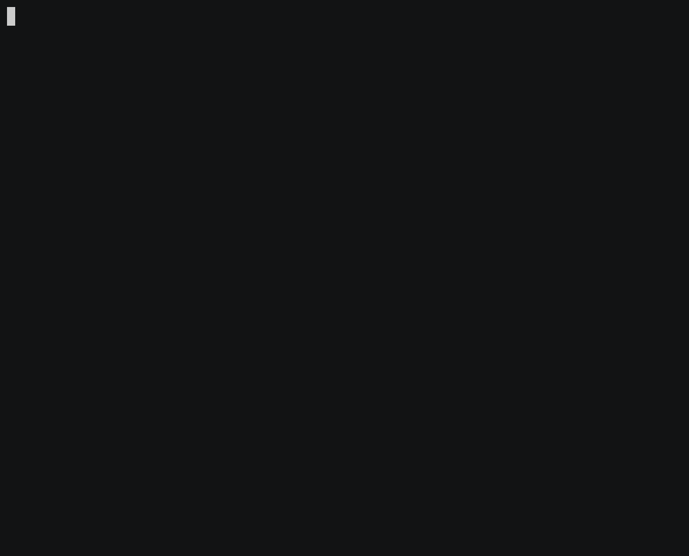
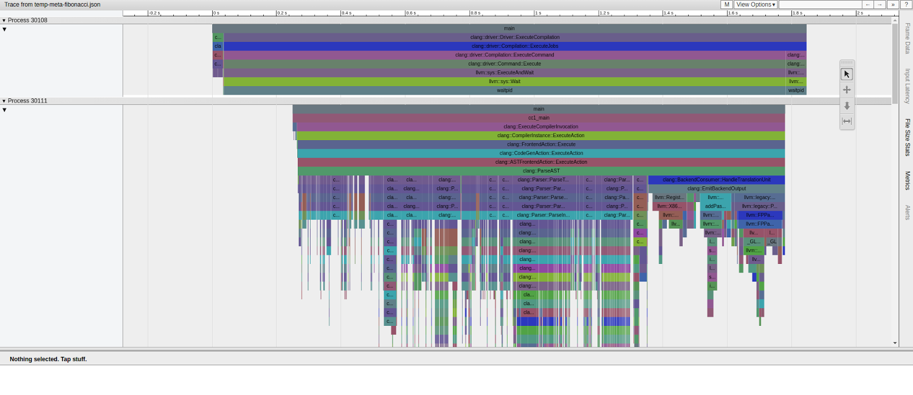

[](https://github.com/namhyung/uftrace/actions/workflows/nightly-test.yml)
[](https://discord.gg/MENMKaCWqD)

uftrace
=======

<a href="https://repology.org/project/uftrace/versions">
    
</a>

uftrace is a function call graph tracer for C, C++, Rust and Python programs.

It hooks into the entry and exit of each function, recording timestamps
as well as the function's arguments and return values. uftrace is capable
of tracing both user and kernel functions, as well as library functions and
system events providing an integrated execution flow in a single timeline.

Initially, uftrace only supported function tracing with compiler support.
However, it now allows users to trace function calls without recompilation
by analyzing instructions in each function prologue and dynamically and
selectively patching those instructions.

Users can also write and run scripts for each function entry and exit using
python/luajit APIs to create custom tools for their specific purposes.

uftrace offers various filters to reduce the amount of trace data and provides
visualization using Chrome trace viewer and flame graph or call-graph diagrams
for graphviz and mermaid, allowing for a big picture view of the execution flow.

It was heavily inspired by the ftrace framework of the Linux kernel and
the name uftrace stems from the combination of user and ftrace.

It can record data from:
- User space C/C++/Rust functions, by either dynamically patching functions
  using `-P.`, or else selective NOP patching using code compiled with `-pg`,
  `-finstrument-functions` or `-fpatchable-function-entry=N`.
- C/C++/Rust Library functions (through PLT hooking)
- Python functions (using Python's trace/profile infrastructure)
- Kernel functions (using the ftrace framework in Linux kernel)
- Kernel trace events (using event tracing framework in Linux kernel)
- Task creation, termination and scheduling events (using Linux perf_event)
- User space events in the target binary or libraries (using SystemTap SDT ABI)
- PMU counter values for given functions (using Linux perf_event)

With the recorded data, uftrace can:
- Show colored and nested function call graphs.
- Show arguments and return values symbolically using libc function prototypes
  and DWARF debug information.
- Apply filters to minimize the amount of trace data in both record and replay time.
- Extract metadata from traces. (e.g. system information on which the trace was taken)
- Generate symbol tables and memory maps of the traced program and library functions.
- Generate task relationship trees (parent and children) of nested programs in traces.

It supports many commands and filters such as filtering by function call
duration for analysis of program execution and performance.



 * Homepage: https://github.com/namhyung/uftrace
 * Tutorial: https://github.com/namhyung/uftrace/wiki/Tutorial
 * Chat: https://discord.gg/MENMKaCWqD (Discord)
 * Mailing list: [uftrace@googlegroups.com](https://groups.google.com/forum/#!forum/uftrace)
 * Lightning talk: https://youtu.be/LNav5qvyK7I


Features
========

uftrace traces each function in the executable and shows time durations.

Usually, for this to be possible, the program needs to be compiled with
`-pg` or `-fpatchable-function-entry=5` (`=2` is enough on aarch64).
With full dynamic tracing (`-P.`|`--patch=.`), uftrace works on all executables (as
long they are not stripped, or symbol information is available from a separate file).

uftrace hooks into the PLT in the given executable file to trace library calls and with
(`-l`|`--nest-libcall`), it also hooks into the procedure linkage tables (PLTs) of shared
libraries. The depth can be limited using `-D<num>`, where 1 is flat call tracing.

Using (`-a`|`--auto-args`), uftrace automatically records arguments and
return values of known functions. Without extra debug information, this
includes the API functions of standard (C language or system) libraries.
This can be combined with `-P.` or `-l`:
For example, `-la` traces nested library calls, even in stripped executables.

In addition, `-a` implies `--srcline`, so it records the source line location info, and
this info can be shown by `uftrace replay --srcline` and in `uftrace tui`. Users can directly
open the editor at the source location as shown in https://uftrace.github.io/slide/#120.

If debug information for the program (`gcc -g`) is available, `--auto-args`
works even on functions inside the user-compiled programs.

In case argument information is not available, argument specifications like
(`-A udev_new@arg1/s`) can be passed on the command line or an options file.

Example:
```py
$ uftrace record -la -A udev_new@arg1/s lsusb >/dev/null
$ uftrace replay -f+module
or simply:
$ uftrace -la -A udev_new@arg1/s -f+module lsusb  # -f+module adds the module name
# DURATION     TID        MODULE NAME   FUNCTION
 306.339 us [ 23561]            lsusb | setlocale(LC_TYPE, "") = "en_US.UTF-8";
   1.163 us [ 23561]            lsusb | getopt_long(1, 0x7fff7175f6a8, "D:vtP:p:s:d:Vh") = -1;
            [ 23561]            lsusb | udev_new("POSIXLY_CORRECT") {
   0.406 us [ 23561] libudev.so.1.7.2 |   malloc(16) = 0x55e07277a7b0;
   2.620 us [ 23561]            lsusb | } /* udev_new */
            [ 23561]            lsusb | udev_hwdb_new() {
   0.427 us [ 23561] libudev.so.1.7.2 |   calloc(1, 200) = 0x55e07277a7d0;
   5.829 us [ 23561] libudev.so.1.7.2 |   fopen64("/etc/systemd/hwdb/hwdb.bin", "re") = 0;
```

You can also dereference an int* argument using the /ip format:
```sh
$ uftrace -A foo@arg1/ip ./a.out
```
Suppose the input pointer address is 0x7ffe789cc654, and the value pointed to is 44.
The output will display the actual dereferenced value:
```sh
# DURATION     TID      FUNCTION
   1.008 us [   4358] | __monstartup();
   0.271 us [   4358] | __cxa_atexit();
[debug] read_task_arg: read int* value = 44 (0x2c)
            [   4358] | main() {
            [   4358] |   foo(44) {
  75.021 us [   4358] |     printf();
   7.667 us [   4358] |     printf();
 343.559 us [   4358] |   } /* foo */
 344.157 us [   4358] | } /* main */
```
This makes uftrace especially helpful when working with pointer-to-int arguments in low-level tracing.

Furthermore, it can show detailed execution flow at function level, and report
which functions had the longest execution time.  It also shows information about
the execution environment.

You can set up filters to exclude or include specific functions when tracing.
In addition, function arguments and return values can be saved and shown later.

It supports multi-process and/or multi-threaded applications.  With root
privileges and if the kernel was built with `CONFIG_FUNCTION_GRAPH_TRACER=y`,
kernel functions can be traced as well.

How to build and install uftrace
================================

On Linux distros, [misc/install-deps.sh](misc/install-deps.sh) can be used to
install required software(s) for building uftrace.  Those are for optional
and advanced features, but are highly recommended.

    $ sudo misc/install-deps.sh

Once you installed required software(s) on your system, it can be built and
installed like following:

    $ ./configure
    $ make
    $ sudo make install

For details about installation and dependencies, please refer to [INSTALL.md](INSTALL.md)


How to use uftrace
==================
These are the commands supported by uftrace:

 * [`record`](doc/uftrace-record.md) : runs a program and saves the trace data
 * [`replay`](doc/uftrace-replay.md) : shows program execution in the trace data
 * [`report`](doc/uftrace-report.md) : shows performance statistics in the trace data
 * [`live`  ](doc/uftrace-live.md)   : does record and replay in a row (default)
 * [`info`  ](doc/uftrace-info.md)   : shows system and program info in the trace data
 * [`dump`  ](doc/uftrace-dump.md)   : shows low-level trace data
 * [`recv`  ](doc/uftrace-recv.md)   : saves the trace data from network
 * [`graph` ](doc/uftrace-graph.md)  : shows function call graph in the trace data
 * [`script`](doc/uftrace-script.md) : runs a script for recorded trace data
 * [`tui`   ](doc/uftrace-tui.md)    : show text user interface for graph and report

You can use `-h` or `--help` option to see available [commands and options](doc/uftrace.md).

    $ uftrace
    uftrace -- function (graph) tracer for userspace

     usage: uftrace [COMMAND] [OPTION...] [<program>]

     COMMAND:
       record          Run a program and saves the trace data
       replay          Show program execution in the trace data
       report          Show performance statistics in the trace data
       live            Do record and replay in a row (default)
       info            Show system and program info in the trace data
       dump            Show low-level trace data
       recv            Save the trace data from network
       graph           Show function call graph in the trace data
       script          Run a script for recorded trace data
       tui             Show text user interface for graph and report

    Try `uftrace --help' or `man uftrace [COMMAND]' for more information.

If omitted, it defaults to the `live` command which is almost same as running
record and replay subcommand in a row (but does not record the trace info
to files).

For recording, the executable needs to be compiled with the `-pg`
(or `-finstrument-functions`) option which generates profiling code
(calling mcount or __cyg_profile_func_enter/exit) for each function.

Note that, there's an experimental support for dynamic tracing on
x86_64 and AArch64(ARM64) which doesn't require such (re-)compilations.
Also, recent compilers have some options to help uftrace
to reduce tracing overhead with similar way
(although it still needs recompilation of your program).
Please see [dynamic tracing](doc/uftrace-record.md#dynamic-tracing) section
for more details.

    $ uftrace tests/t-abc
    # DURATION    TID     FUNCTION
      16.134 us [ 1892] | __monstartup();
     223.736 us [ 1892] | __cxa_atexit();
                [ 1892] | main() {
                [ 1892] |   a() {
                [ 1892] |     b() {
                [ 1892] |       c() {
       2.579 us [ 1892] |         getpid();
       3.739 us [ 1892] |       } /* c */
       4.376 us [ 1892] |     } /* b */
       4.962 us [ 1892] |   } /* a */
       5.769 us [ 1892] | } /* main */

For more analysis, you'd be better recording it first so that it can run
analysis commands like replay, report, graph, dump and/or info multiple times.

    $ uftrace record tests/t-abc

It'll create uftrace.data directory that contains trace data files.
Other analysis commands expect the directory exists in the current directory,
but one can use another using `-d` option.

The `replay` command shows execution information like above.  As you can see,
`t-abc` is a very simple program merely calls a, b and c functions.
In the c function it called getpid() which is a library function implemented
in the C library (glibc) on normal systems - the same goes to __cxa_atexit().

Users can use various filter options to limit functions it records/prints.
The depth filter (`-D` option) is to omit functions under the given call depth.
The time filter (`-t` option) is to omit functions running less than the given
time. And the function filters (`-F` and `-N` options) are to show/hide functions
under the given function.

The `-k` option enables to trace kernel functions as well (needs root access).
With the classic hello world program, the output would look like below (Note,
I changed it to use fprintf() with stderr rather than the plain printf() to make
it invoke system call directly):

    $ sudo uftrace -k tests/t-hello
    Hello world
    # DURATION    TID     FUNCTION
       1.365 us [21901] | __monstartup();
       0.951 us [21901] | __cxa_atexit();
                [21901] | main() {
                [21901] |   fprintf() {
       3.569 us [21901] |     __do_page_fault();
      10.127 us [21901] |     sys_write();
      20.103 us [21901] |   } /* fprintf */
      21.286 us [21901] | } /* main */

You can see the page fault handler and the system call handler for write() were called
inside the fprintf() call.

Also, it can record and show function arguments and return value with `-A` and
`-R` options respectively.  The following example records first argument and
return value of 'fib' (Fibonacci number) function.

    $ uftrace record -A fib@arg1 -R fib@retval tests/t-fibonacci 5

    $ uftrace replay
    # DURATION    TID     FUNCTION
       2.853 us [22080] | __monstartup();
       2.194 us [22080] | __cxa_atexit();
                [22080] | main() {
       2.706 us [22080] |   atoi();
                [22080] |   fib(5) {
                [22080] |     fib(4) {
                [22080] |       fib(3) {
       7.473 us [22080] |         fib(2) = 1;
       0.419 us [22080] |         fib(1) = 1;
      11.452 us [22080] |       } = 2; /* fib */
       0.460 us [22080] |       fib(2) = 1;
      13.823 us [22080] |     } = 3; /* fib */
                [22080] |     fib(3) {
       0.424 us [22080] |       fib(2) = 1;
       0.437 us [22080] |       fib(1) = 1;
       2.860 us [22080] |     } = 2; /* fib */
      19.600 us [22080] |   } = 5; /* fib */
      25.024 us [22080] | } /* main */

The `report` command lets you know which function spends the longest time
including its children (total time).

    $ uftrace report
      Total time   Self time       Calls  Function
      ==========  ==========  ==========  ====================================
       25.024 us    2.718 us           1  main
       19.600 us   19.600 us           9  fib
        2.853 us    2.853 us           1  __monstartup
        2.706 us    2.706 us           1  atoi
        2.194 us    2.194 us           1  __cxa_atexit


The `graph` command shows function call graph of given function.  In the above
example, function graph of function 'main' looks like below:

    $ uftrace graph  main
    # Function Call Graph for 'main' (session: 073f1e84aa8b09d3)
    =============== BACKTRACE ===============
     backtrace #0: hit 1, time  25.024 us
       [0] main (0x40066b)

    ========== FUNCTION CALL GRAPH ==========
      25.024 us : (1) main
       2.706 us :  +-(1) atoi
                :  |
      19.600 us :  +-(1) fib
      16.683 us :    (2) fib
      12.773 us :    (4) fib
       7.892 us :    (2) fib


The `dump` command shows raw output of each trace record.  You can see the result
in the Chrome browser, once the data is processed with `uftrace dump --chrome`.
Below is a trace of clang (LLVM) compiling a small C++ template metaprogram.

[](https://uftrace.github.io/dump/clang.tmp.fib.html)

It also supports flame-graph output as well.  The data can be processed with
`uftrace dump --flame-graph` and passed to
[flamegraph.pl](https://github.com/brendangregg/FlameGraph/blob/master/flamegraph.pl).
Below is a flame graph result of gcc compiling a simple C program.

[](https://uftrace.github.io/dump/gcc.svg)

The `info` command shows system and program information when recorded.

    $ uftrace info
    # system information
    # ==================
    # program version     : uftrace v0.8.1
    # recorded on         : Tue May 24 11:21:59 2016
    # cmdline             : uftrace record tests/t-abc
    # cpu info            : Intel(R) Core(TM) i7-3930K CPU @ 3.20GHz
    # number of cpus      : 12 / 12 (online / possible)
    # memory info         : 20.1 / 23.5 GB (free / total)
    # system load         : 0.00 / 0.06 / 0.06 (1 / 5 / 15 min)
    # kernel version      : Linux 4.5.4-1-ARCH
    # hostname            : sejong
    # distro              : "Arch Linux"
    #
    # process information
    # ===================
    # number of tasks     : 1
    # task list           : 5098
    # exe image           : /home/namhyung/project/uftrace/tests/t-abc
    # build id            : a3c50d25f7dd98dab68e94ef0f215edb06e98434
    # exit status         : exited with code: 0
    # elapsed time        : 0.003219479 sec
    # cpu time            : 0.000 / 0.003 sec (sys / user)
    # context switch      : 1 / 1 (voluntary / involuntary)
    # max rss             : 3072 KB
    # page fault          : 0 / 172 (major / minor)
    # disk iops           : 0 / 24 (read / write)

The `script` command allows user to run a custom script on a data recorded.
The supported script types are Python 3, Python 2.7 and Lua 5.1 as of now.

The `tui` command is for interactive text-based user interface using ncurses.
It provides basic functionality of `graph`, `report` and `info` commands as of
now.


Limitations
===========
- It can trace a C/C++/Rust/Python application on Linux and Android.
- It *cannot* trace an already running process yet.
- It was *not* designed for system-wide tracing in mind.
- It mainly supports x86_64, AArch64 architectures.  It also works on x86 (32-bit), ARM (v6 and v7) but some features like dynamic tracing and automatic argument fetching might not work well.


License
=======
The uftrace program is released under GPL v2.  See [COPYING file](COPYING) for details.
