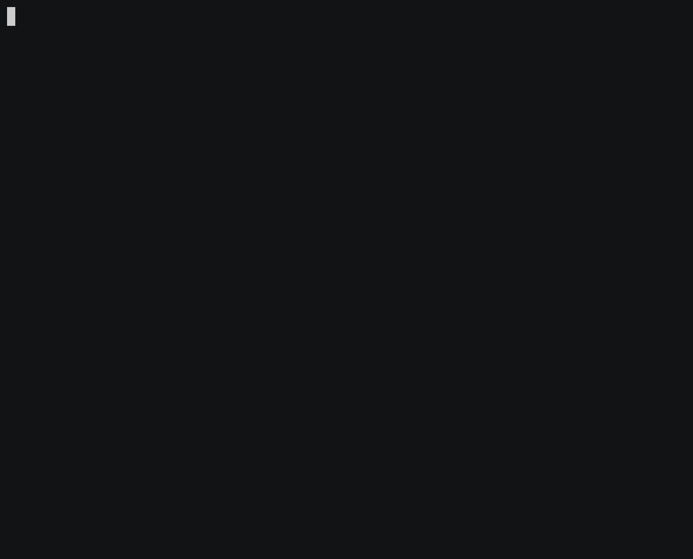

uftrace
=======

uftrace는 C/C++로 쓰인 프로그램의 실행과 분석을 위한 툴이다.
이것은 Linux 커널의 ftrace 프레임워크(특히 함수 그래프 추적)에 크게 영감을 받았고
사용자 공간의 프로그램을 지원한다. 프로그램 실행과 성능 분석에 도움을 주는
다양한 명령어와 필터를 지원한다.

 * 홈페이지: https://github.com/namhyung/uftrace
 * 튜토리얼: https://github.com/namhyung/uftrace/wiki/Tutorial
 * 채팅방: https://gitter.im/uftrace/uftrace
 * 메일 리스트: [uftrace@googlegroups.com](https://groups.google.com/forum/#!forum/uftrace)

기능들
========

프로그램 실행 중 각 함수들과 그 실행 소요시간을 추적한다. 
외부 라이브러리의 호출 또한 지원하지만, 보통 진입과 종료만 지원한다.
다른 (중첩된) 외부 라이브러리의 호출과(혹은) 라이브러리 호출 내의 내부 함수의 호출 또한
선택적으로 추적이 가능하다.

함수 레벨의 구체적인 실행 흐름을 보여주고, 어떤 함수가 가장 많은 오버헤드를
발생시키는지 알려줄 수 있다. 그리고 실행 환경과 관련된 다양한 정보또한 보여준다.

또한 추적할 때 특정 함수를 포함/제외시키기 위해 필터를 설정할 수 있다.
또한, 함수의 인자와 리턴값 또한 저장하고 출력할 수 있다.

멀티 프로세스와 (혹은) 멀티 쓰레드 어플리케이션을 지원한다.
만일 시스템이 커널 내의 함수 그래프 추적(`CONFIG_FUNCTION_GRAPH_TRACER=y`)을 사용한다면,
루트 권한 상에서 (`-k`옵션을 통해) 커널 함수 또한 추적이 가능하다.

uftrace 빌드 및 설치법
================================

리눅스 배포판에서, [misc/install-deps.sh](../../misc/install-deps.sh)가 
이용자 시스템에 요구되는 소프트웨어(들)을 설치해 줄 것이다.
그것들은 선택적으로 쓸 수 있는 심화 기능을 위한 소프트웨어(들)이지만 
함께 설치하길 강하게 권장한다.

    $ sudo misc/install-deps.sh

일단 요구되는 소프트웨어(들)을 설치한 뒤에는, 다음과 같이 빌드 및 설치가 가능하다:

    $ ./configure
    $ make
    $ sudo make install

더 자세한 설치법은, [INSTALL.md](../../INSTALL.md)파일을 참조하라.

uftrace 사용법
==================
uftrace명령어는 다음과 같은 하위 명령을 가진다:

 * `record` : 프로그램을 실행하며 추적 데이터를 저장한다
 * `replay` : 추적 데이터 내의 프로그램 실행을 보여준다
 * `report` : 추적 데이터 내의 수행 통계를 보여준다
 * `live`   : record와 replay를 차례로 수행한다 (기본값)
 * `info`   : 추적 데이터 내의 시스템과 프로그램 정보를 보여준다
 * `dump`   : low-level의 추적 데이터를 보여준다
 * `recv`   : 네트워크로부터 추적한 데이터를 저장한다
 * `graph`  : 추적 데이터 내의 함수 호출 그래프를 보여준다
 * `script` : 저장된 추적 데이터의 스크립트를 실행한다 
 * `tui`    : graph와 report를 위한 텍스트 기반 인터페이스를 보여준다

이용자는 또한 사용가능한 명령어와 옵션을 보기 위해 `-h`, `-?` 혹은 `--help` 옵션을 사용할 수 있다.

    $ uftrace
    Usage: uftrace [OPTION...]
                [record|replay|live|report|info|dump|recv|graph|script|tui] [<program>]
    Try `uftrace --help' or `uftrace --usage' for more information.

만일 하위 명령어를 생략한다면, 기본적으로 record와 replay를 차례로 적용한 것과 동일한
(하지만 추적 정보를 파일로는 저장하지 않는) `live` 명령어가 수행될 것이다.

레코딩을 하기 위해, 각 함수에 프로파일링 코드(calling mcount 혹은 __cyg_profile_func_enter/exit)
를 생성해주기 위해 실행파일은 `-pg`(혹은 `-finstrument-functions`)옵션으로
컴파일 되어야 한다. 

x86_64상에서 그러한 (재)컴파일 과정이 필요하지 않은 동적 추적이
실험적으로 제공되고 있음에 유의하라. 또한 최근 컴파일러들 중 
(여전히 이용자 프로그램을 재컴파일해야 하긴 하지만) 비슷한 방식으로 
uftrace의 추적 과정에서 생기는 오버헤드를 줄이기 위한 옵션들을 제공하고 있다. 
[doc/uftrace-record.md](uftrace-record.md)파일을 참조하라.

    $ uftrace tests/t-abc
    # DURATION    TID     FUNCTION
      16.134 us [ 1892] | __monstartup();
     223.736 us [ 1892] | __cxa_atexit();
                [ 1892] | main() {
                [ 1892] |   a() {
                [ 1892] |     b() {
                [ 1892] |       c() {
       2.579 us [ 1892] |         getpid();
       3.739 us [ 1892] |       } /* c */
       4.376 us [ 1892] |     } /* b */
       4.962 us [ 1892] |   } /* a */
       5.769 us [ 1892] | } /* main */

자세한 분석을 위해, record를 통해 우선 레코딩을 하고 
그리고 나서 replay, report, graph, dump, info와 같은 
분석 명령어를 여러 번 사용하는 것이 좋다. 

    $ uftrace record tests/t-abc

record 명령어는 추적 데이터 파일을 포함하는 uftrace.data 디렉토리를 만들 것이다.
다른 분석 명령어들은 그 디렉토리가 현재 경로에 있을 것으로 예상하지만,
다른 디렉토리를 쓰기 위해서는 `-d`옵션을 사용하면 된다.

`replay` 명령어는 위 실행 결과를 보여준다. 보다시피,
t-abc는 그저 a, b, c 함수를 호출하는 단순한 프로그램이다.
c 함수 내에서, 일반적인 시스템의 C라이브러리(glibc)에 내장된 라이브러리 함수 getpid()를 호출한다.
(__cxa_atexit()도 마찬가지 경우이다.)

이용자들은 함수들의 레코드/출력을 제한하기 위해 다양한 필터를 이용할 수 있다.
깊이 필터 (`-D` 옵션)은 주어진 호출 깊이보다 깊게 호출된 함수들을 생략하는 필터이다.
시간 필터 (`-t` 옵션)은 주어진 시간보다 작은 시간동안 실행된 함수들을 생략하는 필터이다.
그리고 함수 필터(`-F`와 `-N` 옵션)은 주어진 함수 하의 함수들을 보여주고/생략하는 필터이다. 

`-k`옵션으로 커널 함수들 또한 추적이 가능하다(루트 권한 필요). 
소위 말하는 'hello world 프로그램'에 대한 출력 결과는 아래와 같을 겻이다
(시스템 호출을 직접 야기하기 위해, 일반적인 printf()가 아닌 
stderr와 fprintf()를 사용하기로 한 것에 유의하라):

    $ sudo uftrace -k tests/t-hello
    Hello world
    # DURATION    TID     FUNCTION
       1.365 us [21901] | __monstartup();
       0.951 us [21901] | __cxa_atexit();
                [21901] | main() {
                [21901] |   fprintf() {
       3.569 us [21901] |     __do_page_fault();
      10.127 us [21901] |     sys_write();
      20.103 us [21901] |   } /* fprintf */
      21.286 us [21901] | } /* main */

fprintf()호출 내부에서 page fault 핸들러와 write syscall 핸들러가
호출되었음을 볼 수 있다.

또한 함수의 인자와 리턴값을 각각 `-A`와 `-R`옵션으로 레코드하고 보여줄 수 있다.
이하 예제에서는 'fib'(피보나치 숫자)함수의 첫 번째 인자와 리턴값을 레코드한다.

    $ uftrace record -A fib@arg1 -R fib@retval tests/t-fibonacci 5

    $ uftrace replay
    # DURATION    TID     FUNCTION
       2.853 us [22080] | __monstartup();
       2.194 us [22080] | __cxa_atexit();
                [22080] | main() {
       2.706 us [22080] |   atoi();
                [22080] |   fib(5) {
                [22080] |     fib(4) {
                [22080] |       fib(3) {
       7.473 us [22080] |         fib(2) = 1;
       0.419 us [22080] |         fib(1) = 1;
      11.452 us [22080] |       } = 2; /* fib */
       0.460 us [22080] |       fib(2) = 1;
      13.823 us [22080] |     } = 3; /* fib */
                [22080] |     fib(3) {
       0.424 us [22080] |       fib(2) = 1;
       0.437 us [22080] |       fib(1) = 1;
       2.860 us [22080] |     } = 2; /* fib */
      19.600 us [22080] |   } = 5; /* fib */
      25.024 us [22080] | } /* main */

`report`명령어는 어떤 함수가 그 자식을 포함해서 
가장 오랜 시간 실행되었는지, 총 시간을 알 수 있게 한다.

    $ uftrace report
      Total time   Self time       Calls  Function
      ==========  ==========  ==========  ====================================
       25.024 us    2.718 us           1  main
       19.600 us   19.600 us           9  fib
        2.853 us    2.853 us           1  __monstartup
        2.706 us    2.706 us           1  atoi
        2.194 us    2.194 us           1  __cxa_atexit

`graph` 명령어는 주어진 함수의 함수 호출 그래프를 보여준다.
위 예시에서, main 함수의 함수 그래프는 아래와 같을 것이다: 

    $ uftrace graph  main
    # Function Call Graph for 'main' (session: 073f1e84aa8b09d3)
    =============== BACKTRACE ===============
     backtrace #0: hit 1, time  25.024 us
       [0] main (0x40066b)
    
    ========== FUNCTION CALL GRAPH ==========
      25.024 us : (1) main
       2.706 us :  +-(1) atoi
                :  | 
      19.600 us :  +-(1) fib
      16.683 us :    (2) fib
      12.773 us :    (4) fib
       7.892 us :    (2) fib

`dump`명령어는 각 추적 레코드의 원시적인 결과를 보여준다.
데이터를 `uftrace dump --chrome`로 실행한다면, 크롬 브라우저에서 결과를 확인할 수 있다. 
이하는 작은 C++ template metaprogram을 컴파일하는 clang (LLVM)의 추적을 보여준다.

또한 flame-graph형식의 결과 또한 지원한다. 해당 데이터는 `uftrace dump --flame-graph`로 실행되어
[flamegraph.pl](https://github.com/brendangregg/FlameGraph/blob/master/flamegraph.pl)로 넘겨질 수 있다.
이하는 간단한 C 프로그램을 gcc로 컴파일한 결과에 대한 flame graph이다.

`info` 명령어는 레코드되었을 때의 시스템과 프로그램 정보를 보여준다.

    $ uftrace info
    # system information
    # ==================
    # program version     : uftrace v0.8.1
    # recorded on         : Tue May 24 11:21:59 2016
    # cmdline             : uftrace record tests/t-abc 
    # cpu info            : Intel(R) Core(TM) i7-3930K CPU @ 3.20GHz
    # number of cpus      : 12 / 12 (online / possible)
    # memory info         : 20.1 / 23.5 GB (free / total)
    # system load         : 0.00 / 0.06 / 0.06 (1 / 5 / 15 min)
    # kernel version      : Linux 4.5.4-1-ARCH
    # hostname            : sejong
    # distro              : "Arch Linux"
    #
    # process information
    # ===================
    # number of tasks     : 1
    # task list           : 5098
    # exe image           : /home/namhyung/project/uftrace/tests/t-abc
    # build id            : a3c50d25f7dd98dab68e94ef0f215edb06e98434
    # exit status         : exited with code: 0
    # elapsed time        : 0.003219479 sec
    # cpu time            : 0.000 / 0.003 sec (sys / user)
    # context switch      : 1 / 1 (voluntary / involuntary)
    # max rss             : 3072 KB
    # page fault          : 0 / 172 (major / minor)
    # disk iops           : 0 / 24 (read / write)

`script` 명령어는 레코드 된 데이터에 사용자 정의 스크립트를 실행할 수 있게 한다.
지원되는 스크립트는 Python 2.7 뿐이다.

`tui` 명령어는 ncurses를 이용한 텍스트 기반 대화형 유저 인터페이스를 위한 명령어이다.
아직까지는 `graph`, `report`, `info`명령어가 기본적으로 제공하고 있는 기능들을 제공한다.

한계
===========
- 리눅스 상의 native C/C++ 어플리케이션만 추적 가능하다.
- 이미 실행 중인 프로세스의 추적은 *불가능하다*.
- 범시스템 수준의 추적은 *불가능하다*. 
- 아직까지는 x86 (32와 64 bit), ARM (v6 이후 버전), AArch64만 지원가능하다.

라이센스
=======
uftrace는 GPL v2. 라이센스를 따른다. 자세한 내용은 [COPYING file](../../COPYING)을 확인할 것.

번역자
=========
강민철 <tegongkang@gmail.com>
